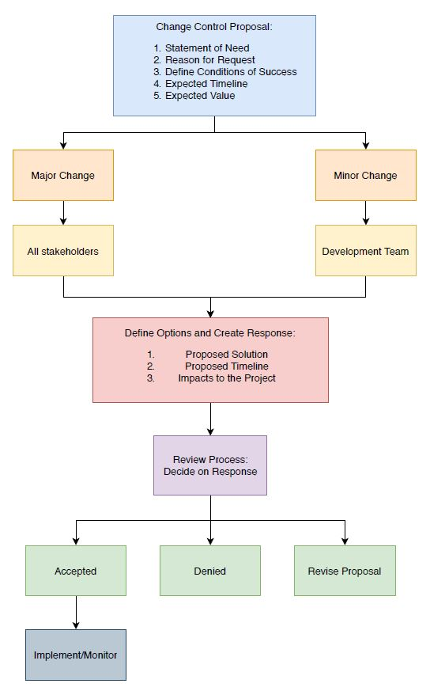

PROJECT PLAN

+ **Project Name: Lending-Library IM**
+ **Team Members: Pierce Beckett, Timothy Robinson, Alexander Martin**
+ **Date: 02/05/2021**

# 1. Introduction
The introduction section of this document provides the project overview, helpful terms including definitions and acronyms, references, and an overview of this document.

## 1.1 Project Overview
A non-profit lending library organization for kids needs to modernize their inventory management system. This project will act as a solution for that issue. The customer of our project would be able to login to the inventory management system and would have remote access to customer information, current inventory, and transaction information, which in turn would allow the company to make informed decisions on updates to the inventory.

## 1.2 Definitions, Acronyms, and Abbreviations
+ LL - Lending-Library
+ IMS - Inventory Management System
+ Admin - Authorized user with access to manage the supposed inventory system.

## 1.3 Overview of Document
This document will address the organization of the LL IMS that will hold all book and customer information. This document will hold information about the organization, team aspects, and preliminary requirements for the software. The organization portion will have the process model, organizational structure/responsibilities, the stakeholders, code inspections, and the change control plan. Section 3 will contain team-specific aspects such as objectives and priorities, team name, meeting times, and team member skills and experiences. The final section will entail preliminary software requirements, covering functional and data requirements, general constraints and assumptions/dependencies, and the user view of product use. 

# 2. Project Organization
The Project Organization section contains information regarding the process model, organization structure and responsibilities, stakeholders, code reviews and inspection, and change control plan.

## 2.1 Process Model

## 2.2 Organizational Structure and Responsibilities

## 2.3 Stakeholders
+ Lending Library - Would be the ones using the product
+ Lending Library Customers - Would be the ones benefiting from the product because the library would be more organized
+ Lending Library IM (us) - Creating the product

## 2.4 Code Reviews and Inspections
When a task is completed the person who completed it will submit the code to the other two team members for review. 
All code will be reviewed and tested by two other members of the team.

## 2.5 Change Control Plan
When a specification changes or a new specification is added, the team will meet to determine how the change will affect their portion of the project. The team will then form an action plan and begin updating their portion of the project.

# 3. Team-Specific Aspects
The Team-Specific Aspects section includes management objectives and priorities, team name, possible meeting times, and range of skills and experience.

## 3.1 Management Objectives and Priorities
+ Staying organized
+ Keep Asuna/Backlog updated
+ Making sure we continue to set weekly goals
+ Continue with good communication
+ Ensuring that each team member knows their role and what they are in charge of

## 3.2 Team Name
Lending-Library IM

## 3.3 Possible Meeting Times
Weeknights and Sundays around 6:00 PM
## 3.4 Team's Range of Skills and Experience
+ Timothy Robinson - PHP, MySQL
+ Pierce Beckett - Frontend Design, PHP, Python scripting
+ Alexander Martin - Proficient in HTML, MySQL, and Project Management. Also has expertise with languages such as C/C++, Python, and Java. 

# 4. Preliminary Sketch of Project Requirements
This section addresses the functional requirements, data requirements, constraints, assumptions and dependencies, guidelines, and the user view of product use.

## 4.1 Overview of Functional Requirements
The functional requirements for this project will be labeled with different letters and they will each have different functions.
+ AC- Account Creation
+ A - Admin
+ C- Customer
+ ISP - Inventory System Performance

+ AC.1 User should be able to create an account via the web application by providing email, phone number, and address.
+ AC.2 User should be able to reset password
+ AC.3 User should be able to view account information that they provided initially
+ A.1 Admin should be able to sign in via the login page
+ A.2 Admin should be able to view current inventory and update/make changes if necessary
+ A.3 Admin should be able to view a list of customers that have signed up and their rentals 
+ A.4 Admin should be able to create new entries into the database
+ C.1 Customer should be able to sign in via login page with their email and password
+ C.2 Customer should be able to view the current inventory available
+ C.3 Customer can view their current and past rentals
+ C.4 Customer should be able to see TBD analytics if possible

## 4.2 Overview of Data Requirements
+ ISP.1 The system should load up quickly and allow the customers and admin/s to access their accounts for satisfactory use.
+ ISP.2 The system will have little to no delay. Allowing the UI/API to function as intended for the user’s computers/phones.
+ ISP.3 A minimum number of users will need to be established to ensure that the server can handle the incoming requests and use. 
+ ISP.4 The web application will have to have reasonable data usage to ensure it isn’t consuming too much phone or computer power usage.

## 4.3 General Constraints, Assumptions, Dependencies, Guidelines
This section contains constraints, assumptions , and guidelines that the software will have. 
### 4.3.1 Constraints
+ User data should be saved and protected through encryption.
+ Only a browser should be needed to access the application.
+ The system should be designed as not to take up too much usage from the device the users access it from. 
+ The system should abide by any privacy and protection laws. 
### 4.3.2 Assumptions, Dependencies, Guidlines 
+ The user has an email and phone number to create an account. 
+ The user must allow their device to access the system application through a browser. 

## 4.4 User View of Product Use
This section covers how the admin and customer will interact and view the system. It will be divided into their 2 different points of view.
### 4.4.1 Admin
The inventory Admin will access the system through the web-based system. The admin can perform actions such as
+ Logging on and off using an email and password
+ Viewing the inventory database
+ Viewing the customer list and information
+ Editing the inventory as necessary
+ Can see the analytics such as most popular rentals
+ Can edit customer info as necessary
### 4.4.2 Customer
The customers will be allowed the actions as follows
+ Creating an account with an email, phone number, and password
+ They can view their information and edit it
+ Can view their past rentals and transactions
+ Can view most popular rental books
+ Can logout of their account 
+ Can reset password
+ Can view different book information
