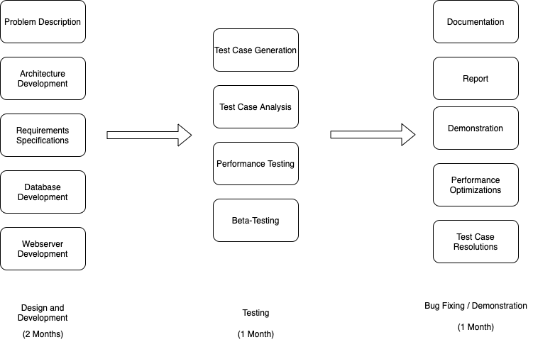

SOFTWARE REQUIREMENTS SPECIFICATION

+ **Project Name: Lending Library IM**
+ **Team Members: Alexander Martin, Pierce Beckett, Timothy Robinson**
+ **Date: 02/16/2021**

# 1. Introduction
The Introduction section includes the following information: the purpose of this document, project scope, definitions, acronyms, and abbreviations, references, and an overview of this document. 

## 1.1 Purpose of this Document
This purpose of this document is to define the functional requirements, any specific characteristics, references, data/performance requirements, the scope of the project. Along with all this, it will also define any specific requirements that the software must have and a change log. 

## 1.2 Project Scope
The Lending Library Inventory Management System aims to provide an efficient inventory management system for a library

## 1.3 Definitions, Acronyms, and Abbreviations
+ LL - Lending Library
+ IMS - Inventory Management System

## 1.4 References

## 1.5 Overview of Document
This document addresses the following sections for the LL IMS: general description information incorporating the personas and characteristics, product perspective, overview of the functional requirements, overview of the data requirements, general dependencies and assumptions, and user view of product use. Section 3 regarding specific requirements includes external interface requirements, detailed description of functional requirements, quality attributes, and other requirements. The conclusion of this document includes a change log for future changes to the SRS document. 

# 2. General Description
The General Description section includes information regarding personas and characteristics, product perspective, overview of functional requirements, overview of data requirements, general dependencies and assumptions, and user view of product use.

## 2.1 User Personas and Characteristics
The user is anyone who is trying to use the application. They either have a specific book or customer they're trying to search for, are entering a new book or customer into the database, or someone who's just browsing the database. Little effort or training is required from the user, just basic knowledge on how to use a webpage and the tools at their disposal given to them by the User Interface.

## 2.2 Product Perspective
This project is a simple IMS application. It offers the ability to search or browse any customer or book in the database, insert new data into the database, or view information about the inventory as a whole. It's mainly designed to be developed over a short period of time (a couple of months) and move into the testing phase in the final weeks of the cycle. The overall project design and timeline are shown in the diagram below:

## 2.3 Overview of Functional Requirements
The functional requirements for the Lending Library Inventory Management system  will be labeled with different letters and they will each have different functions. There are functions for new users, the admin, the already existing customers and software standalone functions.

## 2.4 Overview of Data Requirements
All data must be standardized and made possible to insert into a MySQL database.

## 2.5 General Constraints, Assumptions, Dependencies, Guidelines
### 2.5.1 Constraints
+ User data should be saved and protected through encryption.
+ Only a browser should be needed to access the application.
+ The system should be designed as not to take up too much usage from the device the users access it from.
+ The system should abide by any privacy and protection laws.

### 2.5.2 Assumptions, Dependencies, Guidelines
+ The user has an email and phone number to create an account.
+ The user must allow their device to access the system application through a browser.

## 2.6 User View of Product Use
This section covers how the admin and customer will interact and view the system. It will be divided into their 2 different points of view.
### 2.6.1 Admin
The inventory Admin will access the system through the web-based system. The admin can perform actions such as:
+ Logging on and off using an email and password
+ Viewing the inventory database
+ Viewing the customer list and information
+ Editing the inventory as necessary
+ Can see the analytics such as most popular rentals
+ Can edit customer info as necessary

### 2.6.2 Customer
The customers will be allowed the actions as follows:
+ Creating an account with an email, phone number, and password
+ They can view their information and edit it
+ Can view their past rentals and transactions
+ Can view most popular rental books
+ Can logout of their account
+ Can reset password
+ Can view different book information

# 3. Specific Requirements
This section includes external interface requirements, detailed description of functional requirements, performance requirements, quality attributes, and other requirements.

## 3.1 External Interface Requirements

# 3.1.1 User Interfaces
+ The user must have a device where they can access the internet
+ There should be available program functions for the user to access
+ The page layout should be specified and simple enough for the user to navigate it
+ Screen format requirements aren't limited as long as the device can access a web browser
+ Relative input and outputs must work as intended
# 3.1.2 Hardware Interfaces
+ Any device with access to the internet is supported
+ The hardware must be able to support the browser
+ The hardware must be stable enough to allow the user to run the web application
+ The hardware can be any device from a mobile phone to tablet to computer
# 3.1.3 Software Interfaces
+ There will be no extra software requirements as long as the used device can access a web browser 

## 3.2 Detailed Description of Functional Requirements
The functional requirements for the software are as the following:

+ AC- Account Creation
+ A - Admin
+ C- Customer
+ ISP - Inventory System Performance
+ AC.1 Users should be able to create an account via the web application by providing email, phone number, and address.
+ AC.2 User should be able to reset password
+ AC.3 User should be able to view account information that they provided initially
+ A.1 Admin should be able to sign in via the login page
+ A.2 Admin should be able to view current inventory and update/make changes if necessary
+ A.3 Admin should be able to view a list of customers that have signed up and their rentals
+ A.4 Admin should be able to create new entries into the database
+ C.1 Customer should be able to sign in via login page with their email and password
+ C.2 Customer should be able to view the current inventory available
+ C.3 Customer can view their current and past rentals
+ C.4 Customer should be able to see TBD analytics if possible
+ ISP.1 The system should load up quickly and allow the customers and admin/s to access their accounts for satisfactory use.
+ ISP.2 The system will have little to no delay. Allowing the UI/API to function as intended for the user’s computers/phones.
+ ISP.3 A minimum number of users will need to be established to ensure that the server can handle the incoming requests and use.
+ ISP.4 The web application will have to have reasonable data usage to ensure it isn’t consuming too much phone or computer power usage.

## 3.3 Performance Requirements
The application should perform well enough and have small enough delay and loading time such that it doesn’t significantly impact the user experience or cause frustration to the end user.

## 3.4 Quality Attributes
The application should always be available to the user. The database should always be up and running so that changes can be made to the inventory of the library, an up-to-date library inventory can be viewed, and so that customer information can be accessed. 

## 3.5 Other Requirements

# Change Log

| Version | Date | Description |
|---------|------|-------------|
| 1.0 | 02/16/2021 | Created by the IMS Application Development Team |
